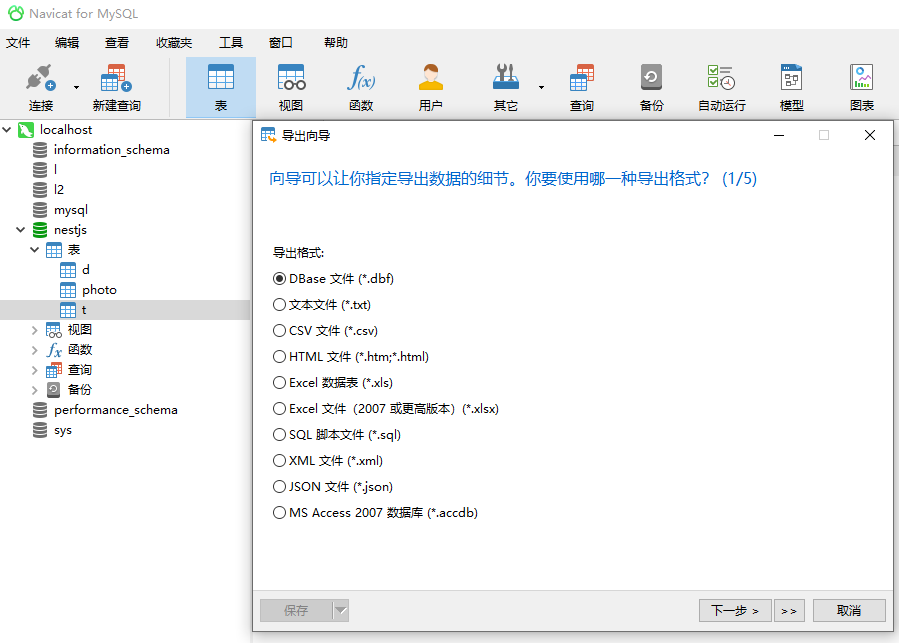

# 构建自己的二进制协议

## 1 将现有二进制转换为JSON

我们使用的是DBase5.0的二进制文件，可以用数据库的可视化工具中导出



### 1.1 认识DBase5.0文件的格式规范

[](http://mng.bz/i7K4)

DBase 5.0 头部规范
| Byte        | 内容           | 描述  |
| --------- |:------------:| -----------------------:|
| 0         | 1 byte       | 有效的dBASE为windows表文件 |
| 1-3       | 3 byte       | 最后更新日期，YYMMDD格式    |
| 4-7       | 32-bit 的数字 | 表中记录数量               |
| 8-9       | 16-bit 的数字 | 头部字节数                 |
| 10-11     | 16-bit的数字  | 记录部分的字节数            |
| ...       | ...          | ...                      |
| 32-n each | 32byte       | 字段描述                   |
| n+1       | 1byte        | 字段分隔符                  |

### 1.2 解析时间

| Byte        | 内容           | 描述  |
| --------- |:------------:| -----------------------:|
| 1-3       | 3 byte       | 最后更新日期，YYMMDD格式    |

> 每一个字节已二进制的地方是包含了所要表示的数字，YY表示以1900为基础的十位数和个位数，用于计算出确切的年份。
> YY可能的取值范围为0x00-0xFF，即1900-2155之间

```javascript
const buf = fs.readFileSync(__dirname + '/t.dbf')
buf[1] // 121
buf[2] // 1
buf[3] // 31

date.setUTCFullYear(1990 + buf[1])
date.setUTCMonth(buf[2])
date.setUTCDate(buf[3])
header.lastUpdated = date.toUTCString()
```

### 1.2 读物32bit整数

| Byte        | 内容           | 描述  |
| --------- |:------------:| -----------------------:|
| 4-7       | 32-bit 的数字 | 表中记录数量               |

从第4个字节开始，是一个32bit的整数类型，32bit占4字节

```javascript
buf.readUInt32LE(4) // 6,只导出了一个表，表里面有6条数据
```

### 1.3 读取16bit整数

| Byte        | 内容           | 描述  |
| --------- |:------------:| -----------------------:|
| 8-9       | 16-bit 的数字 | 头部字节数                 |
| 10-11     | 16-bit的数字  | 记录部分的字节数            |

```javascript
buf.readUInt16LE(8) // 129
buf.readUInt16LE(10) // 263
```

### 1.4 处理表结构

表内容所有的字段定义

| Byte        | 内容           | 描述  |
| --------- |:------------:| -----------------------:|
| 32-n each | 32byte       | 字段描述                   |
| n+1       | 1byte        | 字段分隔符                  |

> 每一个字段的描述是以一个32字节的数据存储起来的，数据库可能包括了多个字段的数据，字段数据的结构是由图表中第二行定义中的单字节的终止符来进行标示的

在第11位时，有个字段数据类型的描述

| Byte        | 内容           | 描述  |
| --------- |:------------:| -----------------------:|
| 11       | 1byte       | 字段类型                   |


| 数据类型        |  描述  |
| --------- |:--------------------------:|
| C (Character)       | OEM 代码页字符           |
| N (Numeric)         | -. 0 1 2 3 4 5 6 7 8 9 |
| I (Int)             | 整数 |

一组表头的描述

| Byte        | 内容           | 描述  |
| --------- |:------------:| -----------------------:|
| 0-10       | 10byte       | 字段名，使用0填充          |
| 11         | 1byte          | 字段类型，int char,varchar等          |
| 16         | 1byte       | 字段的长度          |

```javascript
const fields = []
let fieldOffset = 32
let fieldTerminator = 0x0D // 回车符
// 0x0A 换行符 String.fromCharCode(0x0A.toString(10))

while (buf[fieldOffset] != fieldTerminator) {
    const fieldBuf = buf.slice(fieldOffset, fieldOffset + 32) // 返回快照、引用
    const field = {
        name: fieldBuf.toString('utf-8', 0, 11).replace(/\u0000/g,''),
        type: FIELD_TYPES[fieldBuf.toString('utf-8', 11, 12)],
        length: fieldBuf[16]
    }
    // console.log(field)
    fields.push(field)
    fieldOffset += 32

}
```
输出：
```javascript
fields: [
  { name: 'ID', type: 'Int', typeOf: 'I', length: 4 },
  { name: 'k', type: 'Int', typeOf: 'I', length: 4 },
  { name: 's', type: 'Character', typeOf: 'C', length: 254 }
]
```
### 1.5 处理表内容数据

表文件的头部信息之后便是数据记录。
数据记录前边是一个字节，如果记录没有被删除，那么该字节为一个空格（0x20）;
如果记录被删除，那么该字节为一个空格（0x2A）;

一条数据的描述

| Byte        | 内容           | 描述  |
| --------- |:------------:| -----------------------:|
| 0          | 1byte       | 是否被删除，0x20表示没有删除，0x2A表示被删除 |
| 1-n        | ？byte          | 数据内容         |


```javascript

let startingRecordOffset = header.bytesInHeader;
const records = [];

for (let i = 0; i < header.totalRecords; i++) {
    let recordOffset = startingRecordOffset + (i * header.bytesPerRecord);
    let record = {};

    record._isDel = buf.readUInt8(recordOffset) === 0x2A; // asterisk indicates deleted record
    recordOffset++;

    for (let j = 0; j < fields.length; j++) {
        const field = fields[j];
        const value = buf.toString('utf-8', recordOffset, recordOffset + field.length).trim()
        record[field.name] = TypeFn(value, field.type);
        recordOffset += field.length;
    }

    records.push(record);
}
```

## 2 创建属于自己的二进制协议 

> 要创建二进制协议，首先需要确定传输哪些数据以及如何去表示这些数据。


| Byte        | 内容           | 描述  |
| --------- |:------------:| -----------------------:|
| 0          | 1byte       | 决定数据要写入到哪个数据库 |
| 1          | 1byte       | 一个字节的无符号整数（0-255）用作数据库键储存 |
| 2-n        | 0-n byte    | 储存的数据，任意通过zlib进行压缩的byte |


### 2.1 使用比特来表示选择哪个数据库

1byte = 8bit

查看一个数字的二进制
8..toString(2)


